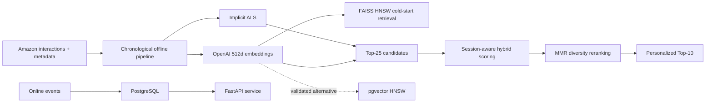

# SemanticCart

A hybrid, session-aware product recommender combining implicit collaborative filtering, OpenAI embeddings, cold-start retrieval, and diversity-aware reranking.

[](https://github.com/salomonhotegni/SemanticCart/actions/workflows/ci.yml)

SemanticCart was evaluated on the Amazon Reviews 2023 Video Games 5-core dataset: 94,762 users, 25,612 products, and 814,586 chronologically ordered interactions. The final model improves held-out NDCG@10 by **9.0%** over implicit ALS while supporting products and sessions without collaborative history.

## System Architecture



For returning users, ALS produces 25 candidates, which are rescored against the latest semantic session profile using a frozen weight of `0.5`. MMR then selects ten products while penalizing semantic, category, and price redundancy. Anonymous sessions use FAISS semantic retrieval, while users without history receive a popularity fallback.

## Held-Out Results

Models were fitted on 719,824 train-plus-validation interactions and evaluated once on 94,762 untouched chronological test events.

| Model | Recall@10 | NDCG@10 | MRR@10 | Coverage |
|---|---:|---:|---:|---:|
| Collaborative ALS | 0.071031 | 0.038802 | 0.029041 | 0.078828 |
| OpenAI content | 0.029484 | 0.015466 | 0.011238 | 0.848242 |
| Long-term hybrid | 0.071031 | 0.038933 | 0.029193 | 0.078828 |
| Returning-user hybrid | 0.071031 | 0.040135 | 0.030708 | 0.078828 |
| Top-25 returning-user | 0.076001 | 0.042232 | 0.031964 | 0.099219 |
| **Diversity-aware reranker** | **0.076128** | **0.042313** | **0.032030** | **0.098867** |

The final model improves Recall@10 by 7.2%, NDCG@10 by 9.0%, MRR@10 by 10.3%, and coverage by 25.4% over ALS. See the [complete test report](results/video_games_5core_final_test.md) and [diversity analysis](results/video_games_5core_diversity.md).

## Cold Start

The semantic index contains all 25,612 catalogue products, including 12 products with no fitting interactions. On the small real cold-item cohort, it achieved Recall@10 of `0.057971` with a 95% Wilson interval of `[0.022772, 0.139794]`. A simulated one-item new-user session achieved Recall@10 of `0.032893` with 95.4% catalogue coverage. See the [cold-start report](results/video_games_5core_cold_start.md).

## Serving Performance

| Workload | p50 | p95 | Throughput |
|---|---:|---:|---:|
| End-to-end API, concurrency 1 | 46.314 ms | 49.783 ms | 21.49 req/s |
| FAISS HNSW retrieval | 0.271 ms | 0.416 ms | 3,448.9 queries/s |
| pgvector HNSW, `ef_search=128` | 2.585 ms | 4.121 ms | 359.4 queries/s |

FAISS remains the deployed in-process engine. pgvector retained 99.96% Top-10 overlap with FAISS and is available as a durable SQL-backed alternative. See the [API](results/video_games_5core_api_latency.md) and [vector retrieval](results/video_games_5core_vector_retrieval.md) benchmarks.

## Local Development

```bash
git clone https://github.com/salomonhotegni/SemanticCart.git
cd SemanticCart
python3.12 -m venv .venv_sc
source .venv_sc/bin/activate
pip install -r requirements.txt -r requirements-dev.txt
PYTHONPATH=src pytest -q
ruff check src scripts tests
```

Raw data, embedding caches, trained models, and the 331.77 MiB serving bundle are intentionally excluded from Git. A fresh clone can run the portable test suite, but the full API requires a reproduced serving bundle.

Once `data/artifacts/video_games_5core/serving/CURRENT` exists:

```bash
cp .env.example .env
docker compose up --detach --build --wait
curl http://127.0.0.1:8001/health
```

## API

```bash
curl -X POST http://127.0.0.1:8001/events -H "Content-Type: application/json" -d '{"user_id":"demo-user","item_id":"B0096QQDPK","event_type":"view"}'
curl "http://127.0.0.1:8001/recommendations/demo-user?k=10"
curl "http://127.0.0.1:8001/similar-products/B0096QQDPK?k=10"
curl "http://127.0.0.1:8001/model-info"
```

Interactive OpenAPI documentation is available at `http://127.0.0.1:8001/docs`.

## Offline Reproduction

Download the [Amazon Reviews 2023 Video Games 5-core interactions](https://amazon-reviews-2023.github.io/data_processing/5core.html) and the pinned [Video Games metadata snapshot](https://huggingface.co/datasets/McAuley-Lab/Amazon-Reviews-2023/blob/8e8816d7d7312396fcac4d5bdd64a63d0b254e56/raw_meta_Video_Games/full-00000-of-00001.parquet):

```bash
mkdir -p data/raw/amazon
curl -L https://mcauleylab.ucsd.edu/public_datasets/data/amazon_2023/benchmark/5core/rating_only/Video_Games.csv.gz -o data/raw/amazon/Video_Games_5core.csv.gz
curl -L 'https://huggingface.co/datasets/McAuley-Lab/Amazon-Reviews-2023/resolve/8e8816d7d7312396fcac4d5bdd64a63d0b254e56/raw_meta_Video_Games/full-00000-of-00001.parquet?download=true' -o data/raw/amazon/meta_Video_Games.parquet
sha256sum data/raw/amazon/meta_Video_Games.parquet
```

The expected metadata SHA-256 is `667a5a71b73291603a9103db7d0c41caf9520dcd1c51f971c1fd28f62842fa83`.

Then run the pipeline stages in order:

```bash
PYTHONPATH=src python scripts/prepare_video_games_interactions.py
PYTHONPATH=src python scripts/prepare_video_games_catalog.py
PYTHONPATH=src python scripts/prepare_openai_embedding_batches.py --fit-through validation --include-catalog-only-products
# Submit, monitor, and collect each prepared chunk with manage_openai_embedding_batches.py
PYTHONPATH=src python scripts/evaluate_final_als.py
PYTHONPATH=src python scripts/evaluate_final_openai_semantic.py
PYTHONPATH=src python scripts/prepare_diversity_candidates.py
PYTHONPATH=src python scripts/evaluate_diversity_reranker.py
PYTHONPATH=src python scripts/build_serving_bundle.py
```

Embeddings use [`text-embedding-3-small`](https://developers.openai.com/api/docs/models/text-embedding-3-small) with 512 dimensions and are cached by content hash and model configuration.

## Limitations

- Five-core filtering emphasizes established users and products rather than the natural production distribution.
- Ratings are treated as binary implicit interactions; this is not a real click, cart, and purchase stream.
- The real cold-item cohort contains only 69 test events, so its confidence interval is reported.
- Simulated new users are established users with deliberately truncated histories.
- One CPU-bound Uvicorn worker saturates under the measured concurrency-eight workload.
- Reproducing the embedding cache requires OpenAI API credentials and incurs API cost.
- No online A/B test has been performed; all quality results are offline estimates.

## Project Origin

The initial prototype was a Coursera Home Depot notebook demonstrating content-based nearest-neighbour recommendations over 2,000 products. The interaction dataset, chronological evaluation, baselines, ALS and hybrid models, cold-start analysis, reranking, versioned artifacts, API, PostgreSQL/pgvector integration, Docker runtime, benchmarks, tests, and CI pipeline were designed and implemented independently.
